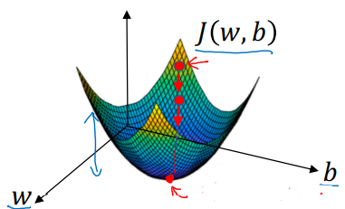
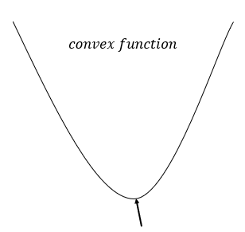
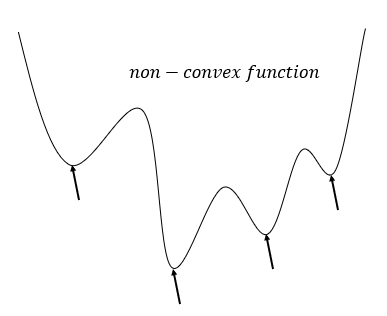
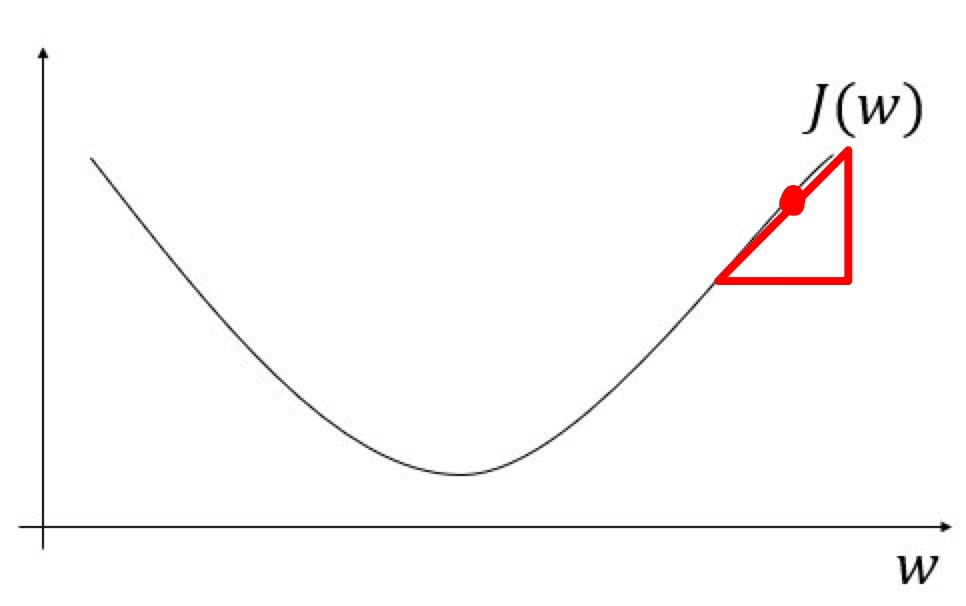
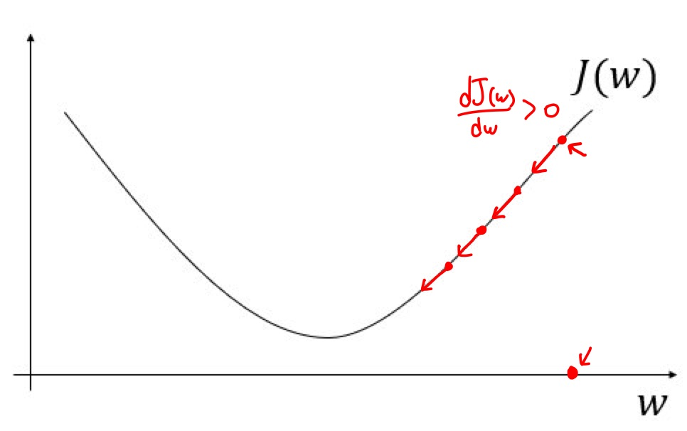
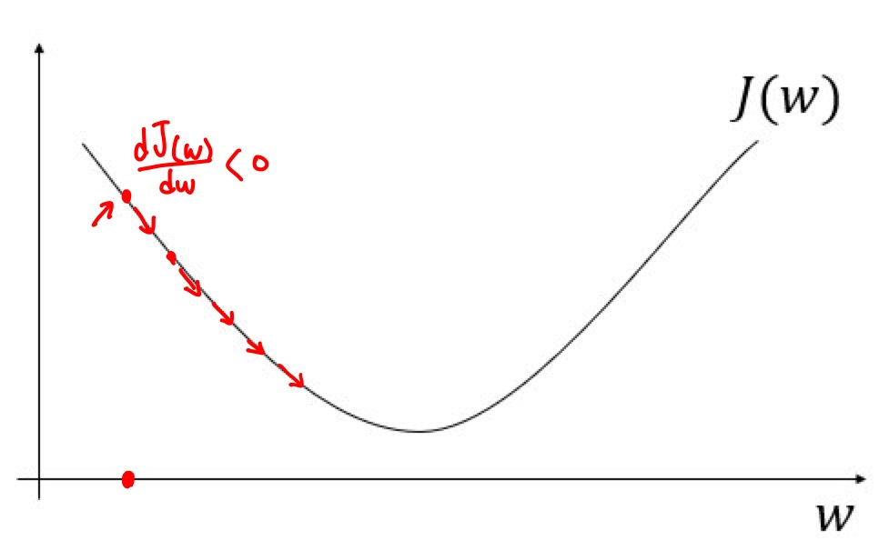
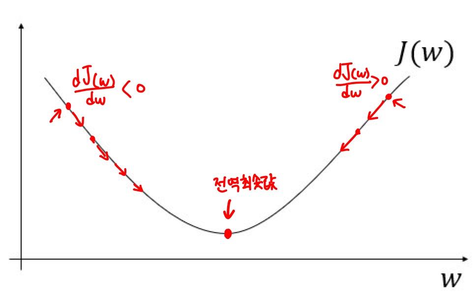

# Gradient Descent (경사하강법)

## 배경
로지스틱 회귀 모델을 학습하는 것 : 비용함수 ( $Cost$함수, $J(w, b)$ )를 최소화해주는, 최소값이 되는 parameter $w, b$를 찾는 것 </br>

### Recap : 로지스틱 회귀모델 사용

$\hat{y} = \sigma(w^Tx+b), \sigma(z)= \displaystyle \frac{1}{1+e^{-z}}$ <br>
* $\hat{y}$ : logistic regression 알고리즘이 정해진 parameter들 $w$와 $b$를 적용해서 출력하는 값<br>

$J(w, b) = \frac{1}{m} \displaystyle \sum_{i=1}^{m}{L({\hat y}^{(i)}, y^{(i)})}$ 
$=-\frac{1}{m}$ $\displaystyle \sum_{i=1}^{m}$ 
$y^{(i)}\log{\hat{y}^{(i)}}+(1-y^{(i)})log(1-\hat{y}^{(i)})$<br>
* Cost function : trainning data set에 대해 얼마나 잘 추측되었는지 측정해주는 함수, <br> 
손실함수( $L$ )를 각각의 trainning sample에 적용한 값의 합들의 평균, 즉 m으로 나눈 값. <br> 
여기서 손실함수는 $\hat{y}$이 얼마나 좋은지를 각 trainning sample에 대한 $y^{i}$와 비교해서 측정


## 목표
> 경사하강법 알고리즘을 사용해 parameter w와 b를 훈련세트에 학습시키는 방법을 알아보기


## 정의
> 경사 하강법(Gradient descent)은 1차 근삿값 발견용 최적화 알고리즘이다. 기본 개념은 함수의 기울기(경사)를 구하고 경사의 반대 방향으로 계속 이동시켜 극값(local optimizer)에 이를 때까지 반복시키는 것이다. [위키백과](https://ko.wikipedia.org/wiki/%EA%B2%BD%EC%82%AC_%ED%95%98%EA%B0%95%EB%B2%95)

<p align="center">  </p>
<p align="center"> Figure1. 비용함수 $J(w,b)$의 그래프 </p>

[Andrew Ng](https://www.youtube.com/watch?v=uJryes5Vk1o&list=PLkDaE6sCZn6Ec-XTbcX1uRg2_u4xOEky0&index=10) 

<p align="center"> 곡면의 높이: 점의 $J(w,b)$값 </p> <br>

<p align="center">  </p> 
<p align="center"> Figure2. convex function </br> </p> 
위의 함수는 convex function(볼록한 함수)라 어디서 초기화를 해도 미분해서 거의 같은 점에 도착하게 되지만 <br> <br>

<p align="center">  </p>
<p align="center"> Figure3. non-convex function </br> </p> 
non-convex function은 위와 같은 함수로 local optimizer이 여러개 나와서 최적의 local optimizer를 찾지 못한다.</br>
→ logistic regression에 위 Figure2.cost비용함수를 사용하는 큰 이유 중 하나이다. </br> </br>

<p align="center">  </p>
<p align="center"> Figure1. 비용함수 $J(w,b)$의 그래프 </br> </p> 

1. 최적의 parameter $w.b$ 값을 찾기위해서는 trainning 시작할때 parameter를 특정 값으로 초기화 해야한다. <br>
logistic regression에는 거의 모든 초기화 방법을 사용할수 있는데 보통 초깃값을 0으로 설정한다. <br>
(무작위 초기화도 가능하지만 보통 logistic regression에는 사용하지 않는다.)
하지만 어디서 초기화를 해도 거의 같은 점에 도착하게 된다. </br>
2. 이 초기점(Figure1.의 빨간 화살표가 가리키는 지점)에서 시작해서 가장 가파른 내리막(빨리 내려올수 있는) 방향으로 한step 내려간다. <br>
3. 위 단계를 반복해서 내려가다보면 Global optimizer(전역최적값,최솟값)에 도달하게 된다.

## Details
**경사 하강법은 아래와 같은 공식으로 w를 update하면서 수렴할때까지 반복한다.**

> $w := w - \alpha \displaystyle\frac{dJ(w)}{dw}$
* $:=$ ; 값을 갱신한다는 의미
* $\alpha$ : learning rate (학습률) - 반복할때 한 step의 크기를 결정
* $\displaystyle\frac{dJ(w)}{dw}$ (미분계수) - update할때 $w$에 줄 변화량, 함수의 기울기(삼각형의 세로/가로)

<p align="center">  </p>
<p align="center"> Figure4. $J(w)$의 미분계수 </p> 

> 이해를 돕기위해 b를 제외해서 1차원으로 가정한 그래프


### Case1. 미분계수 > 0 (양수)
<p align="center">  </p>
<p align="center"> Figure5. $J(w)$의 미분계수 > 0 (양수)인 경우 </p> 

0. Figure5.와 같이 $w$의 시작 지점이 $w$축의 오른쪽 가장자리인 경우
1. $w := w - \alpha \displaystyle\frac{dJ(w)}{dw}$에서 미분계수 > 0 (양수) 
2. $w$에서 미분계수를 빼는것
3. $J(w)$를 감소시킨다. (그래프의 왼쪽 방향으로 이동)


### Case2. 미분계수 < 0 (음수)
<p align="center">  </p>
<p align="center"> Figure5. $J(w)$의 미분계수 < 0 (음수)인 경우 </p> 

0. Figure6.와 같이 $w$의 시작 지점이 $w$축의 왼쪽 가장자리인 경우
1. $w := w - \alpha \displaystyle\frac{dJ(w)}{dw}$에서 미분계수 < 0 (양수) 
2. $\alpha  \times$(-)값  빼면
3. $w$를 증가시킨다.
4. $J(w)$를 감소시킨다. (그래프의 오른쪽 방향으로 이동)
           
           
<p align="center">  </p>           
* 최종적으로 경사하강법은 최적의 parameter $w$에 도달한다.


## Partial
$\partial$ : 소문자 $d$를 다른 폰트로 쓴 것 </br>
* $J$가 1개의 변수를 가지는 함수    → $d$를 사용
* $J$가 2개 이상의 변수를 가진 함수 → $d$대신 $\partial$ 사용

미분 기호 : 여러 변수중 하나에 대한 함수의 기울기를 구하는 것이다.<br>

> $b$를 포함한 $J(w,b)$ 구현해야할 식</br>

$w := w - \alpha \displaystyle\frac{dJ(w,b)}{dw}$ <br>
$b := b - \alpha \displaystyle\frac{dJ(w,b)}{db}$ <br>
$\displaystyle\frac{dJ(w,b)}{dw} = \displaystyle\frac{\partial J(w,b)}{\partial w}$ = $J(w,b)$ 미분계수 ( $J(w,b)$ 가 $w$ 방향으로 얼마나 기울었는지) <br>


## 코드 작성시 표기법
* 관습적으로 <u>변수의 변화를 나타내는 값을 변수이름</u> 으로 지정 
* Ex:`dw, db`

$w = w - \alpha \displaystyle\frac{dJ(w,b)}{dw}$<br>

$\displaystyle\frac{dJ(w,b)}{dw}$=`dw`

```
w=w-a*dw
```

$b = b - \alpha \displaystyle\frac{dJ(w,b)}{db}$<br>

$\displaystyle\frac{dJ(w,b)}{db}$=`db`

```
b=b-a*db
```

---
## 참고
[Gradient Descent-Andrew Ng](https://www.youtube.com/watch?v=uJryes5Vk1o&list=PLkDaE6sCZn6Ec-XTbcX1uRg2_u4xOEky0&index=10)
