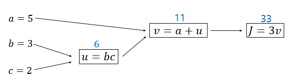
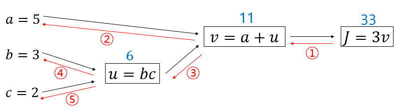
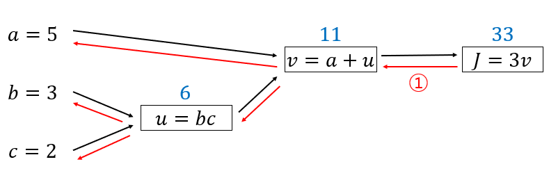
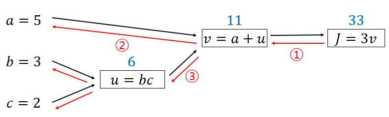
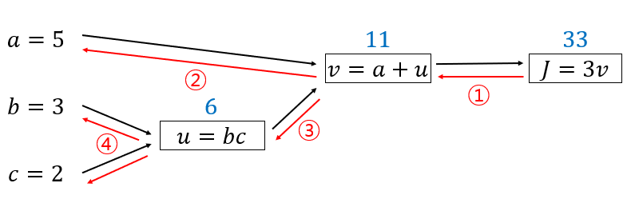
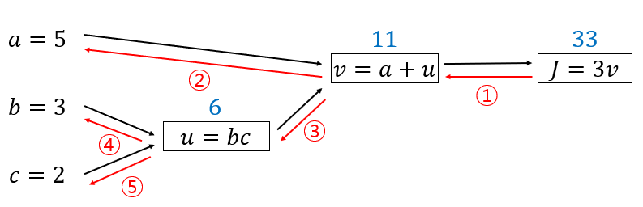

# Derivatives With Computation Graph

## 목표
parameter에 대한 함수 $J$의 도함수( $\displaystyle \frac{dJ}{dw}$ )를 계산하는 방법

= $w$의 변화량 대비 $J$값의 변화량

## Forward Propagation
<p align="center">  </p> </br>
<p align="center"> Figure1. Forward Propagation </p>


### 방법1. 수치미분
$v=11$에 + 0.001증가 → 11.001</br>
$J=33$에 + 0.003증가 → 33.003</br>

> 도함수 = 3

### 방법2. 해석적미분
$v$에 대한 도함수 ( $\displaystyle\frac{dJ}{dv}$ ) $=3$

$f(a)=3a$ ( $v$가 $a$를 대신)

$\displaystyle\frac{df(a)}{da}=\frac{df}{da}=3$

$J=3v$  ( $J$가 $f$를 대신)

$\displaystyle\frac{dJ}{dv}=3$


## Back Propagation
> 마지막 출력값 변수( $J$ )의 $v$에 대한 도함수를 얻으면 그래프의 한단계를 뒤로 가는 것

<p align="center">  </p> </br>
<p align="center"> Figure2. Back Propagation (순서:방법2 참고) </p>

$\displaystyle\frac{dJ}{da}=?$ = $a$값을 증가시키면 $J$에 어떤 영향을 미치는지 확인

### 방법1. 수치미분
$a=5$에 + 0.001증가 → 5.001</br>
$v=11$에 + 0.001증가 → 11.001</br>
$J=33$에 + 0.003증가 → 33.003</br>

= $a:0.001$증가 → $J:0.003$만큼 증가

= $\displaystyle\frac{dJ}{da} = 3$

### 방법2. 자동미분 : Chain Rule
<p align="center">   </p> 
<p align="center"> Figure3. Back Propagation step.1</br> </p> 
<p align="center"> 1. $\displaystyle\frac{dJ}{dv} = 3$ </p> 

<p align="center">  </p> </br>
<p align="center"> Figure4. Back Propagation step.2 </p> </br>
<p align="center"> 2. $\displaystyle\frac{dJ}{da} = \displaystyle\frac{dJ}{dv}\frac{dv}{da} = 3 \times 1 = 3$ </p>

<p align="center"> $a$를 바꾸면 $v$는 같은양으로 변화 → $\displaystyle\frac{dv}{da}=1$ </br> </p> 
<p align="center"> $\displaystyle\frac{dJ}{dv}$ → $\displaystyle\frac{dJ}{da}$ 계산하는데 도움을 줄 수 있다. </p>

<p align="center">  </p> </br>
<p align="center"> Figure5. Back Propagation step.3 </p> </br>
<p align="center"> 3. $\displaystyle\frac{dJ}{du} = 3 = \displaystyle\frac{dJ}{dv}\frac{dv}{du}$ </br>
$\displaystyle\frac{dJ}{du} = 3$ </p> 

<p align="center">  </p> </br>
<p align="center"> Figure6. Back Propagation step.4 </p> </br>
<p align="center"> 4. $\displaystyle\frac{dJ}{db} = \displaystyle\frac{dJ}{du}\frac{du}{db} = 6$ </p> 

<p align="center">  </p>  </br>
<p align="center"> Figure7. Back Propagation step.5 </p>  </br>
<p align="center"> 5. $\displaystyle\frac{dJ}{dc} = \displaystyle\frac{dJ}{du}\frac{du}{dc} = 3 \times 3 = 9$ </p> 

* <font color="red">도함수를 계산할때 효율적인 방법 : 오른쪽에서 왼쪽 방향(역방향) </font>

### 정리
1. $v$에 대한 도함수 구하기
2. 구한 값을 사용해 $a$에 대한 도함수, $u$에 대한 도함수 구하기
3. $u$에 대한 도함수로 $b,c$에 대한 도함수 구하기

## 코드 작성시 표기법
$\displaystyle\frac{dJ}{da} =$  ```da```</br>
$\displaystyle\frac{dJ}{db} =$  ```db```</br>
$\displaystyle\frac{dJ}{dc} =$  ```dc```</br>

---
## 참고
[Derivatives With Computation Graphs-Andrew Ng](https://www.youtube.com/watch?v=nJyUyKN-XBQ&list=PLkDaE6sCZn6Ec-XTbcX1uRg2_u4xOEky0&index=14)
